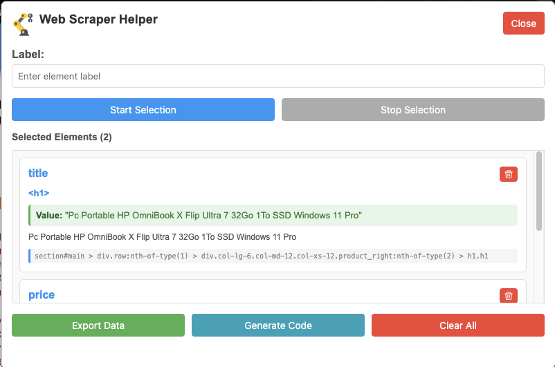

# Web Scraper Helper - Firefox Extension

[](https://github.com/yourusername/web-scraper-helper)
[](https://addons.mozilla.org/)
[](LICENSE)
[](tests/)

## 🎯 Overview

Web Scraper Helper is a powerful Firefox extension that simplifies web scraping by allowing you to visually select HTML elements, label them, and export the data with generated Python scraping code. No coding required - just point, click, and scrape!

## ✨ Features

### 🖱️ **Visual Element Selection**

- Click to select any HTML element on a webpage
- Hover effects show exactly what you're selecting
- Multi-parameter selection (attributes, text content, child elements)

<p align="center">


</p>

### 🏷️ **Smart Labeling System**

- Add custom labels to selected elements
- Organize selections by categories
- Export data with meaningful names

### 🐍 **Python Code Generation**

- Automatically generates BeautifulSoup scraping code
- Ready-to-run Python scripts
- Handles complex selectors and data extraction

### 🗑️ **Individual Item Management**

- Remove specific selections with delete icons
- Clear all selections at once
- Edit and refine selections

### 📊 **Data Export**

- Export selections as JSON
- Includes selectors, text content, attributes, and children
- Timestamp and URL tracking

### 🎨 **User-Friendly Interface**

- Clean, modern popup interface
- Real-time selection feedback
- Smooth animations and transitions

## 🚀 Quick Start

### Installation

Manual Installation (Development)

1. Download the extension files
2. Open Firefox and navigate to `about:debugging`
3. Click "This Firefox"
4. Click "Load Temporary Add-on"
5. Select the `manifest.json` file

### Basic Usage

1. **Open the Extension**: Click the Web Scraper Helper icon in Firefox toolbar

2. **Start Selection**: Enter a label and click "Start Selection"

3. **Select Elements**: Hover over elements on the page (they'll highlight in blue) and click to select

4. **Configure Selection**: A popup appears showing:

   - Text content (value)
   - Attributes (href, alt, class, etc.)
   - Child elements

   Check what you want to save

5. **Stop Selection**: Click "Stop Selection" when done

6. **Export Data**:
   - **JSON**: Click "Export Data" for structured data
   - **Python Code**: Click "Generate Code" for scraping script

## 📖 Detailed Usage Guide

#### Setting Up Development Environment

1. **Clone the repository:**

```code
- git clone https://github.com/yourusername/web-scraper-helper.git
- cd web-scraper-helper
```

2. **Install dependencies:**

```code
- npm install
```

3. **Run tests:**

```code
- npm test
```

4. **Install in Firefox:**
   - Open Firefox → about:debugging
   - Click "This Firefox"
   - Click "Load Temporary Add-on"
   - Select manifest.json

## 🐛 Troubleshooting

Common Issues

- Extension Not Working

  - Check permissions: Ensure extension has access to the website
  - Reload extension: Go to about:debugging and click "Reload"
  - Check console: Open Browser Console (F12) for error messages

- Elements Not Selecting

  - Page restrictions: Some sites block content scripts (e.g., addons.mozilla.org)
  - Iframe content: Extension works in main document only
  - Dynamic content: Wait for page to fully load

- Python Code Not Working

  - Install dependencies: pip install requests beautifulsoup4
  - Check selectors: Verify CSS selectors match the page structure
  - Handle rate limiting: Add delays between requests

🗺️ Roadmap
Version 2.0 (Future)

    [ ] Using of AI for more faster data extraction
    [ ] Cloud storage integration
    [ ] Scheduled scraping
    [ ] Data validation rules
    [ ] Export to multiple formats (CSV, XML, Excel)
